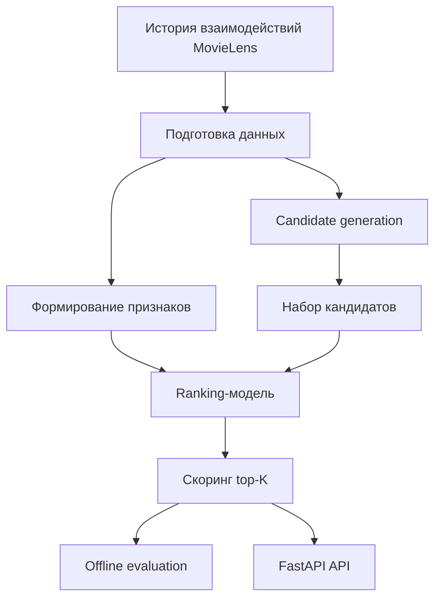

# MovieLens Two-Stage Recommender System

## Кратко
Двухэтапная рекомендательная система на MovieLens: генерация кандидатов, ранжирование, offline evaluation и API для выдачи рекомендаций.

## Задача
Построить рекомендательный контур, который балансирует качество top-K рекомендаций и вычислительные затраты. Вместо полного ранжирования всех объектов используется двухэтапная схема: быстрый candidate generation и более точный ranking на ограниченном наборе кандидатов.

## Что улучшено
- двухэтапная архитектура уменьшает вычислительную нагрузку по сравнению с полным перебором;
- ranking-этап повышает релевантность выдачи относительно candidate-only baseline;
- offline evaluation позволяет безопасно сравнивать версии по единому протоколу до выката API.

## Архитектура


## Метрики и результаты
| Режим | Precision@K | Recall@K | MAP@K | NDCG@K | latency |
|---|---:|---:|---:|---:|---:|
| candidate-only baseline | TBD | TBD | TBD | TBD | TBD |
| two-stage: candidate generation + ranking | TBD | TBD | TBD | TBD | TBD |

Ниже в README добавить краткий вывод о том, какой прирост по `MAP@K` и `NDCG@K` дал ranking и как это соотносится с latency.

## Структура репозитория
- `data/` — данные или подготовленные выборки;
- `notebooks/` — исследовательские эксперименты;
- `src/` — candidate generation, признаки, обучение, ранжирование и оценка;
- `app/` — API-слой для выдачи рекомендаций;
- `artifacts/` — сохранённые модели и промежуточные результаты.

## Запуск
```bash
python -m venv .venv
source .venv/bin/activate
pip install -r requirements.txt
python -m src.train
python -m src.evaluate
uvicorn app.main:app --reload
```

## Ограничения
- проект построен на MovieLens и отражает offline-режим оценки;
- без online signals не измеряется реальное влияние на пользовательское поведение;
- качество чувствительно к выбору признаков, схеме negative sampling и стратегии разбиения данных.

## Направления развития
- добавить более явные baselines;
- вынести признаки и score-пайплайн в конфигурацию;
- добавить аналитику ошибок по типам пользователей и объектов;
- расширить API-слой логированием и диагностикой качества.
